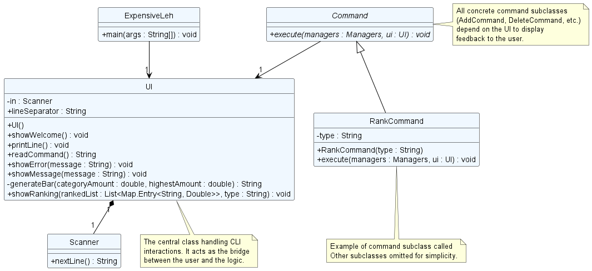
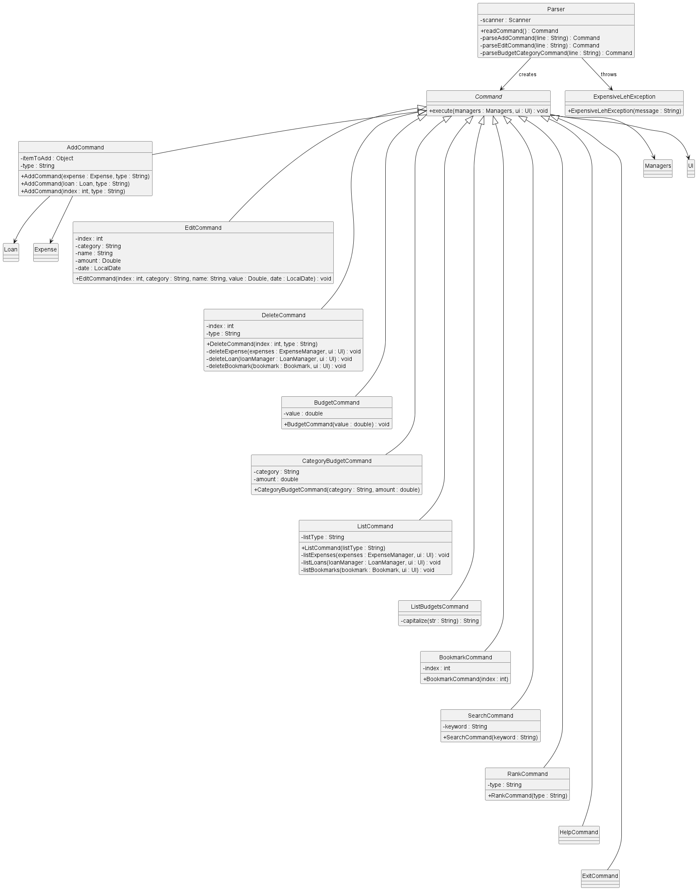
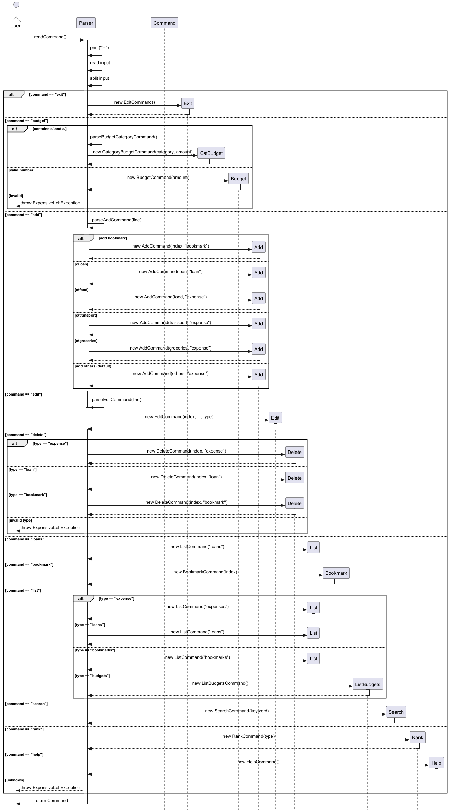
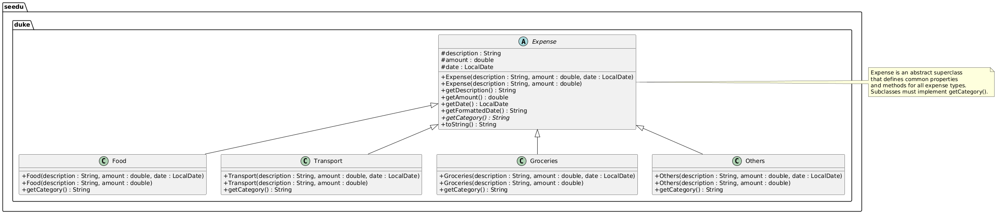
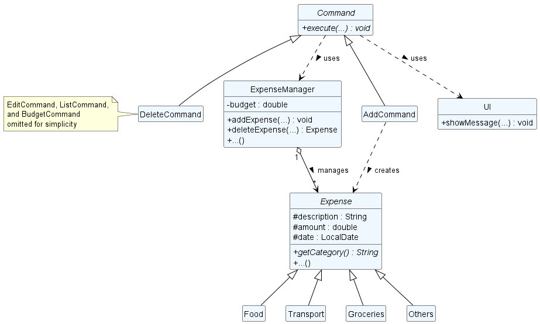
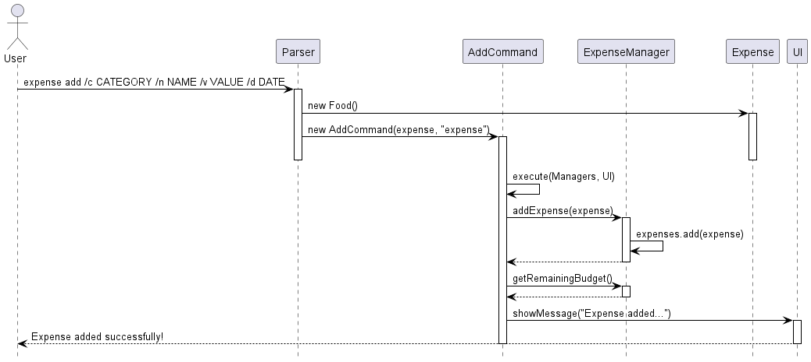
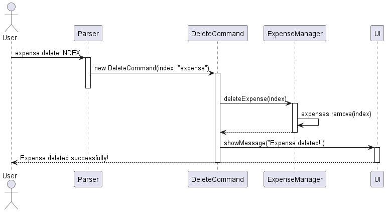
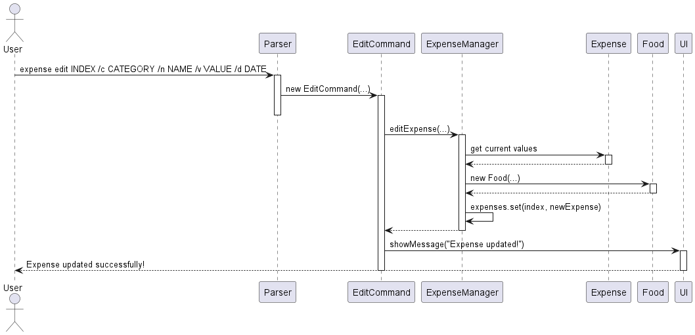
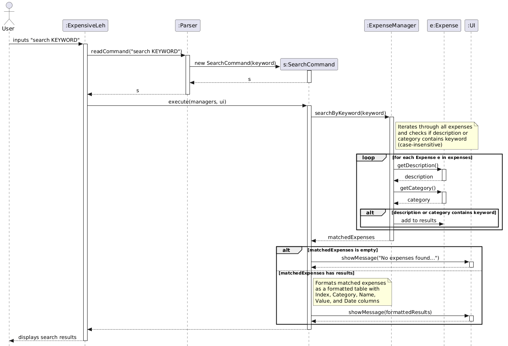

# Developer Guide

## Acknowledgements

{list here sources of all reused/adapted ideas, code, documentation, and third-party libraries -- include links to the original source as well}

## Design

### UI component

The UI component consists of a single `UI` class. Its role is to encapsulate all direct interactions with the user through the standard input and output streams.

The class maintains internal state through its `Scanner` object to prevent redundant input stream creation. Its public method signatures define the "API" through which other components, like the main loop and `Commands`, can interact with the user.



**Architecture and Component Interactivity:**
As illustrated in the class diagram above, the `UI` component acts as the central bridge between the user and the application's logic:
* **Initialization (`ExpensiveLeh`):** The main application class is responsible for instantiating the single `UI` object when the program starts.
* **Encapsulation (`Scanner`):** The `UI` class maintains internal state through a single `Scanner` object. By composing the scanner within the UI, the application prevents redundant input stream creation and potential memory leaks.
* **Dependency (`Command`):** All concrete command subclasses (e.g., `AddCommand`, `RankCommand`) depend on the `UI`. Instead of printing to the console directly, commands pass their execution results to the `UI`'s public methods to be formatted and displayed.

**The UI component's public method API:**

* **Initialization:** The constructor (`UI()`) initializes the scanner for continuous input reading.
* **Reading Input:** The `readCommand()` method is the primary input portal, utilizing the scanner to capture raw user input from the terminal.
* **Simple Output:** The `showWelcome()`, `showMessage()`, and `showError()` methods provide simple, persona-aware feedback (e.g., using the "ExpensiveLeh says ->" prefix or wrapping in line separators) for greetings, success messages, and error notifications.
* **Complex Data Display:** The `showRanking()` method handles the advanced formatting of complex data structures (specifically, creating the visual ASCII bar charts from sorted lists of category or loan totals) before outputting them. It leverages the private `generateBar()` method as an internal helper.

### Logic component

API: `Parser.java`

Here is the class diagram of the `Parser` class of the `Logic` component:


The sequence diagram below illustrates the interactions within the Logic component.


How the Logic component works:

* When `ExpensiveLeh` is called upon to execute a command, the input is passed to the `Parser` object via `readCommand()`, which reads and tokenises the raw input string.
* This results in `Parser` returning a `Command` subclass object, such as `AddCommand`, back to `ExpensiveLeh`.
* `ExpensiveLeh` executes the command by calling `command.execute(managers, ui)`. The command interacts with Managers to carry out its task (e.g. to add an expense).
* After execution, `ExpensiveLeh` calls `storage.save(...)` to maintain the updated data. If parsing fails at any point, an `ExpensiveLehException` is thrown and displayed to the user via the `UI`.

How the parsing works:

* When called upon to parse a user command, the `Parser` class reads the first token of the input as the command keyword and switches on it to determine which `Command` subclass to instantiate.
* For commands with complex arguments, Parser delegates to a private helper method (`parseAddCommand()`, `parseEditCommand()`, or `parseBudgetCategoryCommand())`, which extracts prefixed parameters (`c/`, `n/`, `a/`, `d/`) and returns the appropriate `Command` object.
* All `Command` subclasses (e.g. `AddCommand`, `DeleteCommand`, `EditCommand`) inherit from the `Command` abstract class so that they can be treated similarly where possible.
* This allows `ExpensiveLeh` to call `command.execute(managers, ui)` uniformly regardless of which subclass it holds.

### Expense Superclass

The `Expense` class is an abstract superclass that represents a generic financial transaction. It uses inheritance to support different expense categories while maintaining a common interface.

**Design Structure:**

The `Expense` class provides a unified structure for all types of expenses with the following characteristics:

- **Protected Attributes:**
  - `description: String` - The name or description of the expense
  - `amount: double` - The monetary value of the expense
  - `date: LocalDate` - When the expense occurred (defaults to today if not specified)

- **Core Methods:**
  - `getDescription()`: Returns the expense description
  - `getAmount()`: Returns the expense amount
  - `getDate()`: Returns the expense date as a LocalDate object
  - `getFormattedDate()`: Returns the date formatted as "dd-MM-yyyy"
  - `getCategory()`: Abstract method implemented by subclasses to return the category name
  - `toString()`: Provides a formatted string representation of the expense

**Concrete Subclasses:**

The following concrete subclasses extend `Expense` to represent different expense categories:
- `Food`: Represents food and dining expenses
- `Transport`: Represents transportation expenses
- `Groceries`: Represents grocery and household item expenses
- `Others`: Represents expenses that don't fit other categories

Each subclass implements the `getCategory()` method to return its specific category name.

**Design Rationale:**

Using an abstract superclass provides several benefits:
1. **Polymorphism**: All expenses can be treated uniformly via the `Expense` interface, regardless of category
2. **Code Reuse**: Common functionality (date formatting, getters) is defined once in the superclass
3. **Extensibility**: New expense categories can be added by creating new subclasses without modifying existing code
4. **Type Safety**: Each expense has a fixed category determined by its class type, preventing invalid category strings

**Example:**

When the user adds a food expense with `add c/Food n/Lunch a/10.50`, the parser creates a `Food` object:
```java
Expense lunch = new Food("Lunch", 10.50);
```

Note: The `Expense` class provides two constructor overloads:
- `Expense(String description, double amount, LocalDate date)` - Allows specifying a custom date
- `Expense(String description, double amount)` - Defaults to today's date via `LocalDate.now()`

This expense can then be added to the `ExpenseManager`'s collection and treated as a generic `Expense` object, while still maintaining its specific `Food` category identity through the `getCategory()` method.



*Expense class hierarchy showing the abstract superclass and its concrete subclasses*

### ExpenseManager

The `ExpenseManager` is responsible for managing expenses and budgets:

- **Expense Collection**: Maintains an `ArrayList<Expense>` of all expenses
- **Budget Tracking**: Tracks both global and category-specific budgets
- **Search Functionality**: Implements keyword-based search across expenses

Key methods include:
- `addExpense()`: Adds new expense with validation
- `deleteExpense()`: Removes expense by index with bounds checking
- `editExpense()`: Updates expense fields, allowing category changes
- `setBudget()` / `getBudget()`: Global budget management
- `setCategoryBudget()` / `getCategoryBudget()`: Category-specific budgets
- `getRemainingBudget()`: Calculates remaining global budget
- `getRemainingBudgetForCategory()`: Calculates remaining category budget
- `searchByKeyword()`: Case-insensitive search across descriptions and categories
- `getCategoryTotals()`: Get total expenses by category



*ExpenseManager class showing expense hierarchy and command relationships*

## Implementation

### Application Startup and Main Loop

The startup phase handles the initialization of core components—specifically the User Interface (`UI`)—and establishes the main execution loop that continuously listens for and processes user commands.

The sequence diagram below illustrates the interactions that occur when the user first launches the `ExpensiveLeh` application.


**How the startup and main loop execution works:**

1. When the user launches the application, the main `ExpensiveLeh` class begins its execution.
2. `ExpensiveLeh` creates a new instance of the `UI` class to handle user interactions.
3. `ExpensiveLeh` invokes the `showWelcome()` method on the `UI` object.
4. The `UI` component prints the application's custom ASCII logo and a welcome greeting to the user's console.
5. Following the greeting, the application enters a continuous `loop` that remains active until the exit command ("bye") is triggered.
6. Within this loop, `ExpensiveLeh` calls `ui.readCommand()` to pause execution and wait for the user to type something.
7. The user types a command string into the terminal.
8. When this happens, the `UI` component captures this input and returns the raw command string back to `ExpensiveLeh`.
9. `ExpensiveLeh` then passes this raw string over to the `Parser` component to be interpreted and executed, which eventually leads to specific command flows.


### Expense Management Features

The expense management system in ExpensiveLeh is implemented through the `ExpenseManager` class, which handles all expense-related operations including adding, deleting, editing, searching, and budget tracking.

#### Add Expense Feature

**Proposed Implementation**

The add expense feature is implemented through the `AddCommand` class and `ExpenseManager#addExpense()` method. The flow involves:

1. **Parser Phase**: The user input `expense add /c Food /n Lunch /v 10.50` is parsed to extract category, description, amount, and optionally date.

2. **Command Creation**: Based on the category, an appropriate `Expense` subclass is instantiated (e.g., `Food`, `Transport`, `Groceries`, `Others`).

3. **Execution**: The `AddCommand#execute()` method calls `ExpenseManager#addExpense()` to add the expense after validation.

4. **Validation**: The `ExpenseManager#addExpense()` method validates the expense object:
    - Checks that the expense is not null
    - Ensures amount is non-negative, finite, and not NaN
    - Uses assertions to verify the expense is added to the list

5. **Feedback**: The UI displays a success message with the expense details and remaining budget.

Example:

**Step 1.** The user launches the application and wants to add a new lunch expense. The user enters the command:
```
expense add /c Food /n Lunch /v 10.50
```

**Step 2.** The parser recognizes this as an add expense command and extracts:
- Category: "Food"
- Description: "Lunch"
- Amount: 10.50
- Date: Current date (default)

**Step 3.** The parser creates a `Food` expense object with these parameters and wraps it in an `AddCommand`.

**Step 4.** The `AddCommand#execute()` method is called, which invokes `ExpenseManager#addExpense(expense)`.

**Step 5.** The `ExpenseManager` validates the expense and adds it to the internal `expenses` ArrayList.

**Step 6.** The remaining budget is calculated using `getRemainingBudget()` and the UI displays:
```
Expense added successfully!
================================================
Category : Food
Name     : Lunch
Value    : $10.50
Date     : 01-04-2026
================================================
Remaining Budget: $489.50
```

The following sequence diagram shows how an add expense operation flows through the system:



#### Delete Expense Feature

**Proposed Implementation**

The delete expense feature is implemented through the `DeleteCommand` class and `ExpenseManager#deleteExpense()` method. The implementation includes:

1. **Index-Based Deletion**: Expenses are deleted using a 1-based index as visible to users (internally converted to 0-based).

2. **Bounds Checking**: The `ExpenseManager#deleteExpense()` method validates the index before deletion:
    - Ensures index is non-negative
    - Ensures index is less than the expenses list size

3. **User Feedback**: The UI displays confirmation with the deleted expense's details.

**Example Usage Scenario:**

**Step 1.** The user lists expenses and sees:
```
1. Food | Lunch | $10.50 | 01-04-2026
2. Transport | MRT fare | $2.00 | 01-04-2026
```

**Step 2.** The user decides to delete the first expense and enters:
```
expense delete 1
```

**Step 3.** The parser creates a `DeleteCommand` with index 0 (converted from 1).

**Step 4.** The `DeleteCommand#execute()` calls `ExpenseManager#deleteExpense(0)`.

**Step 5.** The `ExpenseManager` validates the index (0 < 2, so valid) and removes the expense at index 0.

**Step 6.** The UI displays:
```
1: Food Lunch $10.50 01-04-2026 deleted!
```

The following sequence diagram shows how a delete expense operation flows through the system:



#### Edit Expense Feature

**Proposed Implementation**

The edit expense feature is implemented through the `EditCommand` class and `ExpenseManager#editExpense()` method. Key characteristics:

1. **Partial Updates**: Users can edit any combination of fields (category, description, amount, date). Unspecified fields retain their original values.

2. **Category Change Support**: When editing the category, a new expense object of the appropriate type is created and replaces the original.

3. **Validation**: The index is validated before editing, and assertions ensure data integrity.

**Example Usage Scenario:**

**Step 1.** The user wants to change the amount of expense at index 2 from $5.00 to $6.00:
```
expense edit 2 /v 6.00
```

**Step 2.** The `EditCommand#execute()` retrieves the current expense and creates a new one with the updated amount.

**Step 3.** The expense is replaced in the list using `expenses.set(index, newExpense)`.

**Step 4.** The UI confirms the update.



#### Budget Tracking Feature

**Proposed Implementation**

The budget tracking system supports both global and category-specific budgets:

1. **Global Budget**: Stored as a `double budget` field in `ExpenseManager`. The `getRemainingBudget()` method calculates:
   ```
   remainingBudget = budget - sum(all expense amounts)
   ```

2. **Category Budgets**: Stored in a `HashMap<String, Double>` mapping category names to budget limits. The `getRemainingBudgetForCategory()` method calculates:
   ```
   remainingCategoryBudget = categoryBudget - sum(expenses in that category)
   ```

3. **Case Insensitivity**: All category comparisons and keys are stored and compared in lowercase for consistency.

#### Search Expense Feature

**Proposed Implementation**

The search feature allows users to find expenses by keyword using case-insensitive matching across both the expense description and category. It is implemented through the `SearchCommand` class and `ExpenseManager#searchByKeyword()` method. The flow involves:

1. **Parser Phase**: The user input `search KEYWORD` is parsed to extract the search keyword (e.g., "chicken").

2. **Command Creation**: The `Parser` creates a new `SearchCommand` object, passing the lowercase version of the keyword.

3. **Execution**: The `SearchCommand#execute()` method calls `ExpenseManager#searchByKeyword(keyword)` to retrieve matching expenses.

4. **Matching Logic**: The `searchByKeyword()` method:
    - Converts the keyword to lowercase for case-insensitive comparison
    - Iterates through all expenses in the collection
    - Matches expenses where the description OR category contains the keyword (case-insensitive)
    - Returns a new `ArrayList<Expense>` containing all matching expenses

5. **Feedback**: The UI displays results in a formatted table with Index, Category, Name, Value, and Date columns. If no matches are found, a message is displayed.

**Example Usage Scenario:**

**Step 1.** The user has the following expenses in the system:
```
1. Food | Chicken Rice | $8.50 | 20-03-2026
2. Transport | MRT fare | $2.00 | 20-03-2026
3. Groceries | Chicken breast | $12.00 | 21-03-2026
4. Food | Beef noodles | $5.50 | 21-03-2026
```

**Step 2.** The user wants to find all expenses related to "chicken" and enters:
```
search chicken
```

**Step 3.** The `Parser` recognizes the "search" keyword and creates a `SearchCommand` with keyword "chicken". 
The keyword is automatically converted to lowercase internally for case-insensitive matching.

**Step 4.** The `SearchCommand#execute()` calls `ExpenseManager#searchByKeyword("chicken")`.

**Step 5.** The `ExpenseManager` searches through all expenses:
    - "Chicken Rice" description contains "chicken" ✓ (Match 1)
    - "MRT fare" description doesn't contain "chicken" ✗
    - "Chicken breast" description contains "chicken" ✓ (Match 2)
    - "Beef noodles" description doesn't contain "chicken" ✗

**Step 6.** The method returns a list with 2 matching expenses.

**Step 7.** The UI displays:
```
Search results for 'chicken':
Index  Category     Name                 Value       Date
1      Food         Chicken Rice         $8.50       20-03-2026
2      Groceries    Chicken breast       $12.00      21-03-2026
```

**Design Characteristics:**

- **Case-Insensitive Matching**: Both the keyword and expense fields are converted to lowercase for comparison, allowing users to search without worrying about capitalization.
- **Partial Matching**: The search uses substring matching (`.contains()`), so "chick" would match "Chicken Rice" and "Chicken breast".
- **Dual Field Search**: The search checks both expense description and category, providing flexibility. For example, searching "food" would match any Food category expense.
- **Non-Destructive**: Search results are displayed separately and don't modify the actual expense list.

The sequence diagram below illustrates the interactions within the system when a user executes the `search KEYWORD` command:



#### Design Considerations

**Aspect: Budget Storage**

**Alternative 1 (current choice):** Store global budget as `double` and category budgets as `HashMap<String, Double>`.
- *Pros*: Simple, straightforward implementation, easy to query
- *Cons*: No data persistence (budgets are not saved to files)

**Alternative 2:** Create a `Budget` class with methods for all budget operations.
- *Pros*: Encapsulates budget logic, easier to extend, allows persistence integration
- *Cons*: More complex design, additional class to maintain

### Rank Feature

The rank feature allows users to visualize their spending habits or loan distributions by displaying an ordered ASCII bar chart. It supports ranking both expenses (by category) and loans (by person).

The feature is facilitated by `RankCommand`. It relies on `ExpenseManager` or `LoanManager` to calculate the aggregate totals, and the `UI` component to render the visual representation.

The sequence diagram below illustrates the interactions within the system when a user executes the `rank expenses` command.


**How the `RankCommand` execution works:**

1. When the user inputs `rank expenses`, the `Parser` reads the command string.
2. The `Parser` identifies the "expenses" keyword and creates a new `RankCommand` object, passing `"expense"` as the type flag.
3. The `execute(managers, ui)` method is called on the `RankCommand` object.
4. `RankCommand` accesses the central `Managers` object to retrieve the `ExpenseManager`. *(Note: If the command was `rank loans`, it would retrieve the `LoanManager` instead. More details written below).*
5. It calls `getCategoryTotals()` on the `ExpenseManager`, which returns a map containing each category and its total aggregated amount.
6. The `RankCommand` converts this unsorted map into an `ArrayList` and sorts it in descending order based on the monetary values.
7. Finally, `RankCommand` invokes `ui.showRanking()`, passing in the sorted list and the type flag. The `UI` component loops through the list, calculates the proportional length of the ASCII bar for each item relative to the highest amount, and displays the formatted chart to the user.

The same method of execution works for the user input `rank loans` as well. In this similar case, `Parser` identifies the "loans" keyword and carries out the same execution, however, it instead retrieves `LoanManager` and calls `getPersonsTotals()`, which returns a map containing the total aggregated, owed amounts, grouped by person.

## Product scope
### Target user profile

Busy students who want to manage their spending

### Value proposition

Students who are busy require an easy and convenient way to manage their finances. Our product serves as an easy way for
them to track their expenses so that they do not overspend their budgets.

## User Stories

| Version | As a ...  | I want to ...                                               | So that I can ...                                                  |
|---------|-----------|-------------------------------------------------------------|--------------------------------------------------------------------|
| v1.0    | user      | see my past expenses                                        | track my total expenditure                                         |
| v1.0    | user      | log an expense using a single command                       | record expenses quickly without navigating through multiple inputs |
| v2.0    | user      | add people who owe me money                                 | remember to chase them to return my money                          |
| v2.0    | user      | mark people who have returned money owed                    | stop chasing them for money                                        |
| v2.0    | user      | know my remaining budget immediately after logging expenses | know how much money I have saved                                   |
| v2.0    | lazy user | bookmark frequent expenses and add them                     | log them easily without typing everything out                      |

## Non-Functional Requirements

{Give non-functional requirements}

## Glossary

* *glossary item* - Definition

## Instructions for manual testing

{Give instructions on how to do a manual product testing e.g., how to load sample data to be used for testing}