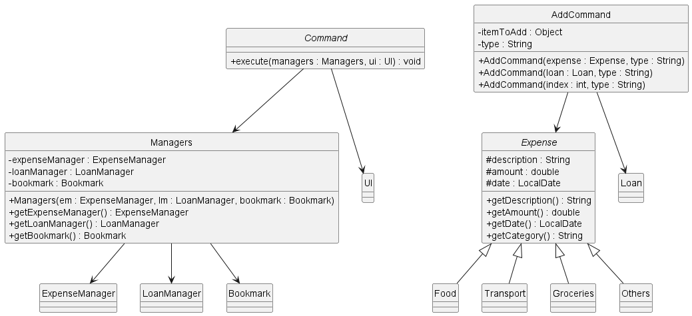
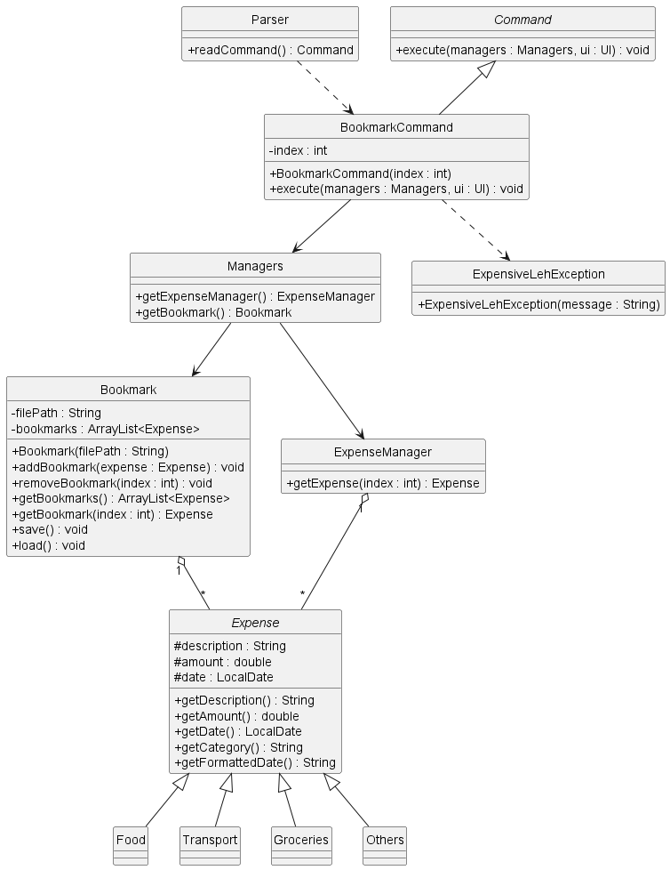
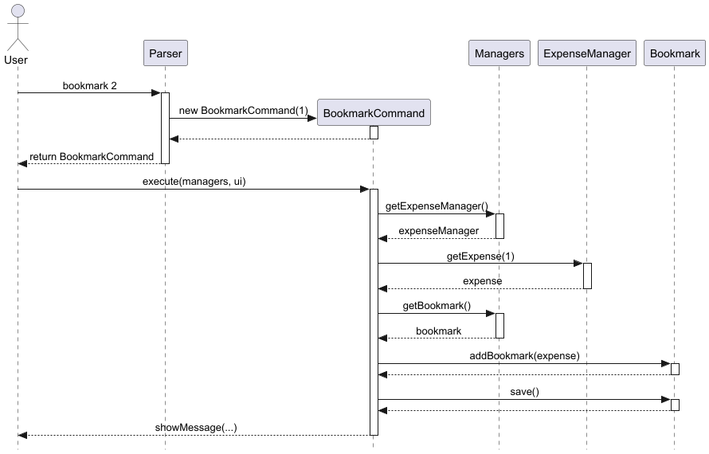

# Developer Guide

## Acknowledgements

This DG has been written with reference to the [SE-AddressBook-DeveloperGuide](https://se-education.org/addressbook-level3/DeveloperGuide.html#proposed-undoredo-feature).

## Design

### UI component

The UI component consists of a single `UI` class. Its role is to encapsulate all direct interactions with the user through the standard input and output streams.

The class maintains internal state through its `Scanner` object to prevent redundant input stream creation. Its public method signatures define the "API" through which other components, like the main loop and `Commands`, can interact with the user.


**Architecture and Component Interactivity:**
As illustrated in the class diagram above, the `UI` component acts as the central bridge between the user and the application's logic:
* **Initialization (`ExpensiveLeh`):** The main application class is responsible for instantiating the single `UI` object when the program starts.
* **Encapsulation (`Scanner`):** The `UI` class maintains internal state through a single `Scanner` object. By composing the scanner within the UI, the application prevents redundant input stream creation and potential memory leaks.
* **Dependency (`Command`):** All concrete command subclasses (e.g., `AddCommand`, `RankCommand`) depend on the `UI`. Instead of printing to the console directly, commands pass their execution results to the `UI`'s public methods to be formatted and displayed.

**The UI component's public method API:**

* **Initialization:** The constructor (`UI()`) initializes the scanner for continuous input reading.
* **Reading Input:** The `readCommand()` method is the primary input portal, utilizing the scanner to capture raw user input from the terminal.
* **Simple Output:** The `showWelcome()`, `showMessage()`, and `showError()` methods provide simple, persona-aware feedback (e.g., using the "ExpensiveLeh says ->" prefix or wrapping in line separators) for greetings, success messages, and error notifications.
* **Complex Data Display:** The `showRanking()` method handles the advanced formatting of complex data structures (specifically, creating the visual ASCII bar charts from sorted lists of category or loan totals) before outputting them. It leverages the private `generateBar()` method as an internal helper.


### Parser component

API: `Parser.java`

Here is the class diagram of the `Parser` component:


The class diagram below shows the dependencies of `Command` on `Managers`, `UI`, 
and `Expense` subclasses:


The sequence diagram below illustrates the interactions within the `Parser` component:


How the `Parser` component works:

* When `ExpensiveLeh` is called upon to execute a command, the input is passed to the `Parser` object via `readCommand()`, which reads and tokenises the raw input string.
* This results in `Parser` returning a `Command` subclass object, such as `AddCommand`, back to `ExpensiveLeh`.
* `ExpensiveLeh` executes the command by calling `command.execute(managers, ui)`. The command interacts with Managers to carry out its task (e.g. to add an expense).
* After execution, `ExpensiveLeh` calls `storage.save(...)` to maintain the updated data. If parsing fails at any point, an `ExpensiveLehException` is thrown and displayed to the user via the `UI`.

How the parsing works:

* When called upon to parse a user command, the `Parser` class reads the first token of the input as the command keyword and switches on it to determine which `Command` subclass to instantiate.
* For commands with complex arguments, Parser delegates to a private helper method (`parseAddCommand()`, `parseEditCommand()`, or `parseBudgetCategoryCommand())`, which extracts prefixed parameters (`c/`, `n/`, `a/`, `d/`) and returns the appropriate `Command` object.
* All `Command` subclasses (e.g. `AddCommand`, `DeleteCommand`, `EditCommand`) inherit from the `Command` abstract class so that they can be treated similarly where possible.
* This allows `ExpensiveLeh` to call `command.execute(managers, ui)` uniformly regardless of which subclass it holds.


### Storage Component

API:  `Storage.java`

The `Storage` component is responsible for reading data from, and writing data to, the hard disk. This ensures that
user data—such as budgets, expenses, and loans—is persisted across different sessions of the application.

It uses a **singleton** data pattern, whereby only one `Storage` object is instantiated in the application.
`Storage` creates a single `StorageData` object,
containing `Loans`, `Expenses`, `Budget` and `categoryBudgets`. In other words, the `storageData`
object **encapsulates** the various data types used by ExpensiveLeh, 
allowing for easy transfer between the storage layer and main logic. During data operations,

* The `Storage` object calls `save()` and converts in-memory objects (those in `storageData`) to a text format to be saved on the hard disk.
* On application start, `Storage` calls `load()` and parses the file line-by-line, recreating the objects in `StorageData`. 

In addition, error handling is handled through `IOException` when corrupted data or invalid file formats are encountered. 
`Logger` is also used to track the line where error corruption has occurred.

### Expense Superclass

The `Expense` class is an abstract superclass that represents a generic financial transaction. It uses inheritance to support different expense categories while maintaining a common interface.

**Design Structure:**

The `Expense` class provides a unified structure for all types of expenses with the following characteristics:

- **Protected Attributes:**
  - `description: String` - The name or description of the expense
  - `amount: double` - The monetary value of the expense
  - `date: LocalDate` - When the expense occurred (defaults to today if not specified)

- **Core Methods:**
  - `getDescription()`: Returns the expense description
  - `getAmount()`: Returns the expense amount
  - `getDate()`: Returns the expense date as a LocalDate object
  - `getFormattedDate()`: Returns the date formatted as "dd-MM-yyyy"
  - `getCategory()`: Abstract method implemented by subclasses to return the category name
  - `toString()`: Provides a formatted string representation of the expense

**Concrete Subclasses:**

The following concrete subclasses extend `Expense` to represent different expense categories:
- `Food`: Represents food and dining expenses
- `Transport`: Represents transportation expenses
- `Groceries`: Represents grocery and household item expenses
- `Others`: Represents expenses that don't fit other categories

Each subclass implements the `getCategory()` method to return its specific category name.

**Design Rationale:**

Using an abstract superclass provides several benefits:
1. **Polymorphism**: All expenses can be treated uniformly via the `Expense` interface, regardless of category
2. **Code Reuse**: Common functionality (date formatting, getters) is defined once in the superclass
3. **Extensibility**: New expense categories can be added by creating new subclasses without modifying existing code
4. **Type Safety**: Each expense has a fixed category determined by its class type, preventing invalid category strings

**Example:**

When the user adds a food expense with `add c/Food n/Lunch a/10.50`, the parser creates a `Food` object:
```java
Expense lunch = new Food("Lunch", 10.50);
```

Note: The `Expense` class provides two constructor overloads:
- `Expense(String description, double amount, LocalDate date)` - Allows specifying a custom date
- `Expense(String description, double amount)` - Defaults to today's date via `LocalDate.now()`

This expense can then be added to the `ExpenseManager`'s collection and treated as a generic `Expense` object, while still maintaining its specific `Food` category identity through the `getCategory()` method.


*Expense class hierarchy showing the abstract superclass and its concrete subclasses*


### ExpenseManager

The `ExpenseManager` is responsible for managing expenses and budgets:

- **Expense Collection**: Maintains an `ArrayList<Expense>` of all expenses
- **Budget Tracking**: Tracks both global and category-specific budgets
- **Search Functionality**: Implements keyword-based search across expenses

Key methods include:
- `addExpense()`: Adds new expense with validation
- `deleteExpense()`: Removes expense by index with bounds checking
- `editExpense()`: Updates expense fields, allowing category changes
- `setBudget()` / `getBudget()`: Global budget management
- `setCategoryBudget()` / `getCategoryBudget()`: Category-specific budgets
- `getRemainingBudget()`: Calculates remaining global budget
- `getRemainingBudgetForCategory()`: Calculates remaining category budget
- `searchByKeyword()`: Case-insensitive search across descriptions and categories
- `getCategoryTotals()`: Get total expenses by category


*ExpenseManager class showing expense hierarchy and command relationships*


## Implementation

### Application Startup and Main Loop

The startup phase handles the initialization of core components—specifically the User Interface (`UI`)—and establishes the main execution loop that continuously listens for and processes user commands.

The sequence diagram below illustrates the interactions that occur when the user first launches the `ExpensiveLeh` application.


**How the startup and main loop execution works:**

1. When the user launches the application, the main `ExpensiveLeh` class begins its execution.
2. `ExpensiveLeh` creates a new instance of the `UI` class to handle user interactions.
3. `ExpensiveLeh` invokes the `showWelcome()` method on the `UI` object.
4. The `UI` component prints the application's custom ASCII logo of the name `ExpensiveLeh` and a welcome greeting to the user's console.
5. Following the greeting, the application enters a continuous `loop` that remains active until the exit command ("bye") is triggered.
6. Within this loop, `ExpensiveLeh` calls `ui.readCommand()` to pause execution and wait for the user to type something.
7. The user types a command string into the terminal.
8. When this happens, the `UI` component captures this input and returns the raw command string back to `ExpensiveLeh`.
9. `ExpensiveLeh` then passes this raw string over to the `Parser` component to be interpreted and executed, which eventually leads to specific command flows.

---

### Expense Management Features

The expense management system in ExpensiveLeh is implemented through the `ExpenseManager` class, which handles all expense-related operations including adding, deleting, editing, searching, and budget tracking.

#### Add Expense Feature

**Proposed Implementation**

The add expense feature is implemented through the `AddCommand` class and `ExpenseManager#addExpense()` method. The flow involves:

1. **Parser Phase**: The user input `add c/Food n/Lunch a/10.50` is parsed to extract category, description, amount, and optionally date.

2. **Command Creation**: Based on the category, an appropriate `Expense` subclass is instantiated (e.g., `Food`, `Transport`, `Groceries`, `Others`).

3. **Execution**: The `AddCommand#execute()` method calls `ExpenseManager#addExpense()` to add the expense after validation.

4. **Validation**: The `ExpenseManager#addExpense()` method validates the expense object:
    - Checks that the expense is not null
    - Ensures amount is non-negative, finite, and not NaN
    - Uses assertions to verify the expense is added to the list

5. **Feedback**: The UI displays a success message with the expense details and remaining budget.

Example:

**Step 1.** The user launches the application and wants to add a new lunch expense. The user enters the command:
```
add c/Food n/Lunch a/10.50
```

**Step 2.** The parser recognizes this as an add expense command and extracts:
- Category: "Food"
- Description: "Lunch"
- Amount: 10.50
- Date: Current date (default)

**Step 3.** The parser creates a `Food` expense object with these parameters and wraps it in an `AddCommand`.

**Step 4.** The `AddCommand#execute()` method is called, which invokes `ExpenseManager#addExpense(expense)`.

**Step 5.** The `ExpenseManager` validates the expense and adds it to the internal `expenses` ArrayList.

**Step 6.** The remaining budget is calculated using `getRemainingBudget()` and the UI displays:
```
Expense added successfully!
================================================
Category : Food
Name     : Lunch
Value    : $10.50
Date     : 01-04-2026
================================================
Remaining Budget: $489.50
```

The following sequence diagram shows how an add expense operation flows through the system:


---

#### Delete Expense Feature

**Proposed Implementation**

The delete expense feature is implemented through the `DeleteCommand` class and `ExpenseManager#deleteExpense()` method. The implementation includes:

1. **Index-Based Deletion**: Expenses are deleted using a 1-based index as visible to users (internally converted to 0-based).

2. **Bounds Checking**: The `ExpenseManager#deleteExpense()` method validates the index before deletion:
    - Ensures index is non-negative
    - Ensures index is less than the expenses list size

3. **User Feedback**: The UI displays confirmation with the deleted expense's details.

**Example Usage Scenario:**

**Step 1.** The user lists expenses and sees:
```
1. Food | Lunch | $10.50 | 01-04-2026
2. Transport | MRT fare | $2.00 | 01-04-2026
```

**Step 2.** The user decides to delete the first expense and enters:
```
delete expense 1
```

**Step 3.** The parser creates a `DeleteCommand` with index 0 (converted from 1).

**Step 4.** The `DeleteCommand#execute()` calls `ExpenseManager#deleteExpense(0)`.

**Step 5.** The `ExpenseManager` validates the index (0 < 2, so valid) and removes the expense at index 0.

**Step 6.** The UI displays:
```
1: Food Lunch $10.50 01-04-2026 deleted!
```

The following sequence diagram shows how a delete expense operation flows through the system:


---

#### Edit Expense Feature

**Proposed Implementation**

The edit expense feature is implemented through the `EditCommand` class and `ExpenseManager#editExpense()` method. Key characteristics:

1. **Partial Updates**: Users can edit any combination of fields (category, description, amount, date). Unspecified fields retain their original values.

2. **Category Change Support**: When editing the category, a new expense object of the appropriate type is created and replaces the original.

3. **Validation**: The index is validated before editing, and assertions ensure data integrity.

**Example Usage Scenario:**

**Step 1.** The user wants to change the amount of expense at index 2 from $5.00 to $6.00:
```
edit 2 a/6.00
```

**Step 2.** The `EditCommand#execute()` retrieves the current expense and creates a new one with the updated amount.

**Step 3.** The expense is replaced in the list using `expenses.set(index, newExpense)`.

**Step 4.** The UI confirms the update.


#### Budget Tracking Feature

**Proposed Implementation**

The budget tracking system supports both global and category-specific budgets:

1. **Global Budget**: Stored as a `double budget` field in `ExpenseManager`. The `getRemainingBudget()` method calculates:
   ```
   remainingBudget = budget - sum(all expense amounts)
   ```

2. **Category Budgets**: Stored in a `HashMap<String, Double>` mapping category names to budget limits. The `getRemainingBudgetForCategory()` method calculates:
   ```
   remainingCategoryBudget = categoryBudget - sum(expenses in that category)
   ```

3. **Case Insensitivity**: All category comparisons and keys are stored and compared in lowercase for consistency.

#### Search Feature

**Proposed Implementation**

The search feature allows users to find expenses and loans by keyword using case-insensitive matching across both the description and category fields. It is implemented through the `SearchCommand` class, `ExpenseManager#searchByKeyword()` method, and `LoanManager#searchByKeyword()` method. The flow involves:

1. **Parser Phase**: The user input `search KEYWORD` is parsed to extract the search keyword (e.g., "chicken").

2. **Command Creation**: The `Parser` creates a new `SearchCommand` object, passing the lowercase version of the keyword.

3. **Execution**: The `SearchCommand#execute()` method calls both:
   - `ExpenseManager#searchByKeyword(keyword)` to retrieve matching expenses
   - `LoanManager#searchByKeyword(keyword)` to retrieve matching loans

4. **Matching Logic**: Both search methods:
    - Convert the keyword to lowercase for case-insensitive comparison
    - Iterate through all items in their respective collections
    - Match items where the description OR category contains the keyword (case-insensitive)
    - Return a new `ArrayList` containing all matching items

5. **Result Display**: The UI displays:
   - A "Search results for 'KEYWORD':" header
   - "--- Expenses ---" section with matched expenses (if any)
   - "--- Loans ---" section with matched loans (if any)
   - Formatted tables with Index, Category, Name, Value, and Date columns
   - If no matches found, displays "No expenses or loans found with keyword: 'KEYWORD'"

**Example Usage Scenario:**

**Step 1.** The user has the following data:
```
Expenses:
1. Food | Chicken Rice | $8.50 | 20-03-2026
2. Transport | MRT fare | $2.00 | 20-03-2026
3. Groceries | Chicken breast | $12.00 | 21-03-2026
4. Food | Beef noodles | $5.50 | 21-03-2026

Loans:
1. Loan | John | $50.00 | 19-03-2026
2. Loan | Chicken Dinner Catering | $45.00 | 20-03-2026
```

**Step 2.** The user wants to find all expenses and loans related to "chicken" and enters:
```
search chicken
```

**Step 3.** The `Parser` recognizes the "search" keyword and creates a `SearchCommand` with keyword "chicken". 
The keyword is automatically converted to lowercase internally for case-insensitive matching.

**Step 4.** The `SearchCommand#execute()` calls:
   - `ExpenseManager#searchByKeyword("chicken")`
   - `LoanManager#searchByKeyword("chicken")`

**Step 5.** The `ExpenseManager` searches through all expenses:
    - "Chicken Rice" description contains "chicken" ✓ (Match 1)
    - "MRT fare" description doesn't contain "chicken" ✗
    - "Chicken breast" description contains "chicken" ✓ (Match 2)
    - "Beef noodles" description doesn't contain "chicken" ✗

**Step 6.** The `LoanManager` searches through all loans:
    - "John" description doesn't contain "chicken" ✗
    - "Chicken Dinner Catering" description contains "chicken" ✓ (Match 1)

**Step 7.** Both managers return their matching results.

**Step 8.** The UI displays:
```
Search results for 'chicken':

--- Expenses ---
Index  Category     Name                 Value       Date
1      Food         Chicken Rice         $8.50       20-03-2026
2      Groceries    Chicken breast       $12.00      21-03-2026

--- Loans ---
Index  Category     Name                 Value       Date
1      Loan         Chicken Dinner Ca... $45.00      20-03-2026
```

**Design Characteristics:**

- **Case-Insensitive Matching**: Both the keyword and item fields are converted to lowercase for comparison, allowing users to search without worrying about capitalization.
- **Partial Matching**: The search uses substring matching (`.contains()`), so "chick" would match "Chicken Rice", "Chicken breast", and "Chicken Dinner Catering".
- **Dual Field Search**: The search checks both description and category, providing flexibility. For example, searching "food" would match any Food category expense, and searching "loan" would match all loans.
- **Unified Results**: Results from both expenses and loans are displayed together in organized sections, making it easy to see all matching items at once.
- **Non-Destructive**: Search results are displayed separately and don't modify the actual data.

The sequence diagram below illustrates the interactions within the system when a user executes the `search KEYWORD` command:


#### Design Considerations

**Aspect: Budget Storage**

**Alternative 1 (current choice):** Store global budget as `double` and category budgets as `HashMap<String, Double>`.
- *Pros*: Simple, straightforward implementation, easy to query
- *Cons*: No data persistence (budgets are not saved to files)

**Alternative 2:** Create a `Budget` class with methods for all budget operations.
- *Pros*: Encapsulates budget logic, easier to extend, allows persistence integration
- *Cons*: More complex design, additional class to maintain

---

### Rank Feature

The rank feature allows users to visualize their spending habits or loan distributions by displaying an ordered ASCII bar chart. It supports ranking both expenses (by category) and loans (by person).

The feature is facilitated by `RankCommand`. It relies on `ExpenseManager` or `LoanManager` to calculate the aggregate totals, and the `UI` component to render the visual representation.

The sequence diagram below illustrates the interactions within the system when a user executes the `rank expenses` command.


**How the `RankCommand` execution works:**

1. When the user inputs `rank expenses`, the `Parser` reads the command string.
2. The `Parser` identifies the "expenses" keyword and creates a new `RankCommand` object, passing `"expense"` as the type flag.
3. The `execute(managers, ui)` method is called on the `RankCommand` object.
4. `RankCommand` accesses the central `Managers` object to retrieve the `ExpenseManager`. *(Note: If the command was `rank loans`, it would retrieve the `LoanManager` instead. More details written below).*
5. It calls `getCategoryTotals()` on the `ExpenseManager`, which returns a map containing each category and its total aggregated amount.
6. The `RankCommand` converts this unsorted map into an `ArrayList` and sorts it in descending order based on the monetary values.
7. Finally, `RankCommand` invokes `ui.showRanking()`, passing in the sorted list and the type flag. The `UI` component loops through the list, calculates the proportional length of the ASCII bar for each item relative to the highest amount, and displays the formatted chart to the user.

The same method of execution works for the user input `rank loans` as well. In this similar case, `Parser` identifies the "loans" keyword and carries out the same execution, however, it instead retrieves `LoanManager` and calls `getPersonsTotals()`, which returns a map containing the total aggregated, owed amounts, grouped by person.

### Storage Feature


#### How it works
Whenever `save()` method is invoked in `main`, 
1. File System Initialisation
   1. The `Storage` object checks if the parent directory for the save file exists using `File`. If it doesn't, one is made.
   2. If directory creation fails, an IOException is thrown, ensuring the application does not write to a non-existent path.
2. Writing of Data using `Filewriter` into the data file
   1. The global `budget` is first written.
   2. A loop iterates through the `categoryBudgets` hashmap, writing each category and amount.
   3. For each `Expense` object, an `instanceof` check is conducted to find out the type of expense. Following this,
   the `description`, `amount` and `date` is retrieved and written.
   4. Similarly, the loop is repeated for each `loan` object and the attributes are written.
3. Resource Cleanup
   1. After all data is written, `FileWriter` is destroyed and `Storage` hands control back to `main`.

The data is written using a predetermined delimited string format, which can be referred to in the **Instructions for Manual Testing**.

#### Design Considerations

1. **Data Serialisation Strategy** 
- **Decision**: The implementation uses a Delimiter-Separated Values (DSV) format rather than standard formats like JSON or XML
- **Rationale**: This makes the data file human-readable and easy to parse using simple string splitting without needing external libraries.
- **Trade-off**: Requires substantial defensive checks when loading data, as users might input characters that fail to parse. 

---

### Bookmarks Feature

**Proposed Implementation**

The bookmark feature is facilitated by the `Bookmark` class in the `storage` package and `BookmarkCommand` in the `seedu.duke` package. 
The `Bookmark` class maintains an`ArrayList<Expense>` of bookmarked expenses, stored internally and persisted to a file. 
It implements the following operations:

- `Bookmark.addBookmark(expense)` — Adds an expense in the expense list to the bookmark list.
- `Bookmark.removeBookmark(index)` — Removes a bookmarked expense at the given index in the bookmark list.
- `Bookmark.getBookmark(index)` — Retrieves a bookmarked expense at the given index in the bookmark list.
- `Bookmark.save()` — Persists the current bookmark list to the save file.
- `Bookmark.load()` — Loads the bookmark list from the save file on startup.

Here is the class diagram of `Bookmark`:



The sequence diagram below illustrates the interactions within the system when a user executes the `Bookmark` command.



Given below is an example usage of `BookmarkCommand`:

**Step 1.** The user executes `bookmark 2` to bookmark the 2nd expense in the expense list. 
`Parser` parses the index and creates a `BookmarkCommand(1)`.

**Step 2.** `BookmarkCommand.execute()` retrieves the expense at index 1 from `ExpenseManager` via `Managers.getExpenseManager()`.

**Step 3.** `Bookmark.addBookmark(expense)` is called to add the retrieved expense to the bookmark list.

**Step 4.** `Bookmark.save()` is called to immediately persist the updated bookmark list to `data/bookmarks.txt`.

**Design Considerations**

**Aspect: How bookmarks are persisted**

**Alternative 1 (current choice):** Save the entire bookmark list to file after every modification.
- *Pros*: Simple to implement. The save file is always up to date, so no data is lost if the application crashes.
- *Cons*: Rewrites the entire file even for a single addition or deletion, which may be slow if the bookmark list is large.

**Alternative 2:** Persist bookmarks only when the application exits, rather than after every modification.
- *Pros*: More efficient as file read or write only happens once per session.
- *Cons*: If the application crashes mid-session, all bookmark changes made during that session will be lost

**Aspect: How bookmarked expenses are stored**

**Alternative 1 (current choice):** Store bookmarks as `Expense` objects in an `ArrayList`, saved to a separate file from expenses.
- *Pros*: Bookmarks are independent of the expense list, so deleting an expense does not affect saved bookmarks.
- *Cons*: The bookmarked expense and the original expense are separate copies, so edits to the original expense are not reflected in the bookmark.

**Alternative 2:** Store bookmarks as indices referencing the expense list.
- *Pros*: Bookmarks always reflect the latest state of the referenced expense since they point directly to it.
- *Cons*: Bookmarks become invalid if the referenced expense is deleted or if the expense list order changes, requiring additional validation logic.

---


## Product scope
### Target user profile

Busy students who want to manage their spending

### Value proposition

Students who are busy require an easy and convenient way to manage their finances. Our product serves as an easy way for
them to track their expenses so that they do not overspend their budgets.

## User Stories

| Version | As a ...       | I want to ...                                               | So that I can ...                                                                       |
|---------|----------------|-------------------------------------------------------------|-----------------------------------------------------------------------------------------|
| v1.0    | new user       | be able to access a help function                           | easily see and learn how I can start using the product features without much difficulty |
| v1.0    | user           | see my past expenses                                        | track my total expenditure                                                              |
| v1.0    | user           | have an easy to use interface                               | use the  product without much difficulty and fatigue                                    |
| v1.0    | impatient user | log an expense using a single command                       | record expenses quickly without navigating through multiple inputs                      |
| v1.0    | user           | delete an expense                                           | remove unwanted entries and entries that are no longer needed                           |
| v2.0    | user           | edit an existing expense or loan                            | easily correct any misinputs I made or make changes to entries without difficulty       |
| v2.0    | user           | add people who owe me money                                 | remember to chase them to return my money                                               |
| v2.0    | user           | see my total money lent and to who                          | see a summary of money I lent and to who                                                |
| v2.0    | user           | mark people who have returned my money                      | stop chasing them for money                                                             |
| v2.0    | user           | see my past loans                                           | remember all my loans                                                                   |
| v2.0    | user           | know my remaining budget immediately after logging expenses | know how much money I have saved                                                        |
| v2.0    | user           | rank my expenses                                            | easily see which category of expense where I have spent the most                        |
| v2.0    | user           | rank my loans                                               | easily see who owes me the most money                                                   |
| v2.0    | visual learner | have a visual representation of my expenses and loans       | easily view my expense and loans progress at a single glance                            |
| v2.0    | busy user      | search for my expenses and loans by keyword                 | easily find my saved expenses and loans                                                 |

## Non-Functional Requirements

1. Should work on any mainstream OS as long as it has Java 17 installed.
2. A user with above average typing speed for regular English text (i.e. not code, not system admin commands) should be
able to accomplish most of the tasks faster using commands than using the mouse.
3. The application should respond to user commands within 1 second.
4. The application does not require internet access and can be run fully locally.
5. Errors shown are descriptive in order to tell users what went wrong. 

## Glossary

* **Mainstream OS**: Windows, Linux, Unix, MacOS
* **Expenses**: Food, Groceries, Transport, Others
* **Name** and **Description** are used interchangeably to mean the name/description of the expense or loan.
* **Budget** refers to the global budget. This must be more than the sum of **category budgets**.
* **Category budgets** refer to either the budget for **Food**, **Groceries**, **Transport** or **Others**.


## Instructions for manual testing

Given below are instructions to test the app manually. Note that users are expected to more exploratory testing.

### Adding an expense/loan

Correct format: `add c/CATEGORY a/AMOUNT n/DESCRIPTION [d/DATE]`

Eg: `add c/food a/10 n/Mcdonalds` 

1. Test case: Add without additional information.

    Eg: `add`. 
- Expected: `Missing details. Usage: add c/CATEGORY n/NAME a/AMOUNT [d/DD-MM-YYYY]`

2. Test case: Incomplete compulsory parameter(s).
  
    Eg: `add c/ a/10 n/KFC`
- Expected: `CATEGORY is required. Usage: add c/CATEGORY n/NAME a/AMOUNT [d/DD-MM-YYYY]`
Note: The error corresponds to the incomplete parameter. In this case, it is `CATEGORY`. It may also be `NAME` or `AMOUNT`. 

3. Test case: Negative amount provided.
    
    Eg: `add c/food a/-20 n/KFC`
- Expected: `Amount must be positive!`.

### Searching for expenses and loans

Correct format: `search KEYWORD`

1. Test case: `search`.
- Expected: `Please provide a keyword to search. Usage: search KEYWORD`

2. Test case: `search chicken` (keyword that matches expenses and loans).
- Expected: Displays all expenses and loans containing "chicken" in the name or category.

3. Test case: `search FOOD` (case-insensitive search by category).
- Expected: Displays all Food category expenses. Search is case-insensitive.

4. Test case: `search xyz` (keyword with no matches).
- Expected: `No expenses or loans found with keyword: 'xyz'`

5. Test case: `search mrt` (partial keyword match).
- Expected: Displays the expense with "MRT" in its name or category.

6. Test case: `search loan` (search by category).
- Expected: Displays all loans since they match the "loan" category.

### Saving data
**WARNING:** Save a copy of expenses.txt elsewhere first before attempting any changes to expenses.txt.

The table below summarises the expected formats in expenses.txt

| Category        | Format                                | Remarks                                                                                                                   |
|-----------------|---------------------------------------|---------------------------------------------------------------------------------------------------------------------------|
| Budget          | BUDGET \| AMOUNT                      | BUDGET is in all **uppercase**                                                                                            |
| Category Budget | CATEGORY_BUDGET \| CATEGORY \| AMOUNT | CATEGORY_BUDGET is in all **uppercase**, CATEGORY is in **lowercase**, and refers to food, transport, groceries or others |
| Loan            | L \| NAME \| AMOUNT \| DATE           | NAME can be either uppercase or lowercase                                                                                 |
| Food            | F \| NAME \| AMOUNT \| DATE           | NAME can be either uppercase or lowercase                                                                                 |
| Groceries       | G \| NAME \| AMOUNT \| DATE           | NAME can be either uppercase or lowercase                                                                                 |
| Transport       | T \| NAME \| AMOUNT \| DATE           | NAME can be either uppercase or lowercase                                                                                 |
| Others          | O \| NAME \| AMOUNT \| DATE           | NAME can be either uppercase or lowercase                                                                                 |

| Parameter       | Data Type/format |
|-----------------|------------------|
| BUDGET          | double           |
| CATEGORY_BUDGET | double           |
| CATEGORY        | string           |
| AMOUNT          | double           |
| NAME            | string           |
| DATE            | YYYY-MM-DD       |

#### 1. Testing for expected behaviour
1. Start with no `./data` directory
2. Start the application and add expenses, loans, and budgets.
3. Check that `./data/expenses.txt` exists and the data format follows the table above.
4. Restart the application and edit/add more data.
5. Check that `./data/expenses.txt` reflects the changes.

#### 2. **Dealing with corrupted data in the expenses.txt file**


To simulate corrupted data, open the expenses.txt file and perform any of the following changes:
1. remove or add `|` from any of the lines
2. replace a number with a character
3. change the date format
4. Insert a negative amount for `BUDGET` , `CATEGORY BUDGET` or expense/loan `AMOUNT`
5. replace the expenses or loan category from `F`, `G`, `T`, `O`, `L` to another string or character

Expected: `WARNING: Corrupted line LINE_COUNT: REASON`, where `LINE_COUNT` is an integer corresponding to the line in expenses.txt
and `REASON` is the error encountered when loading the line.

Example: At line 3 of expenses.txt, input `F | KFC | 3.0  2026-04-11`

Output: `WARNING:  Corrupted line 3: Incorrect number of '|' provided. Line deleted.`

The application will automatically delete the corrupted line, and move on to the next line.   


