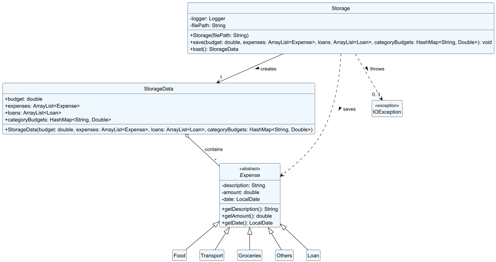
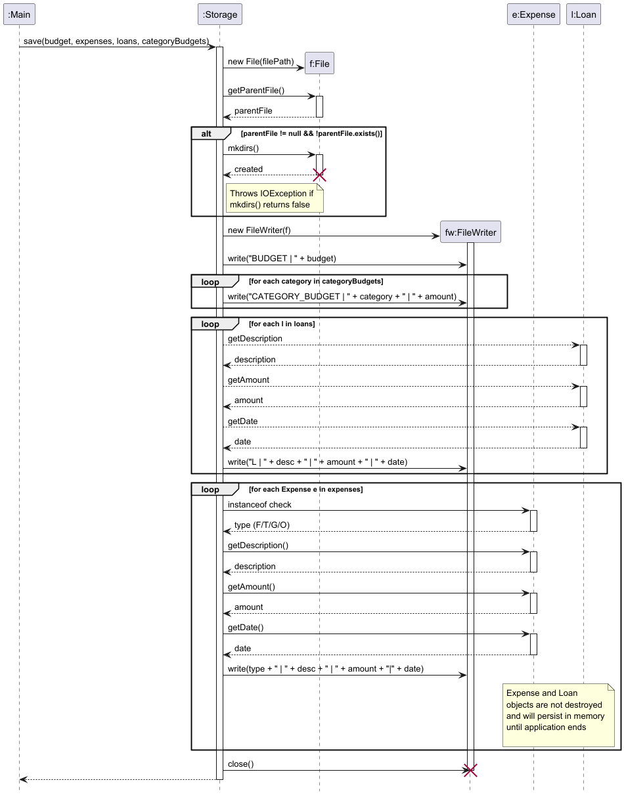

# Ivan Tan - Project Portfolio Page

## Overview

ExpensiveLeh is a CLI for managing your personal finances. Users can indicate their budget and add expenses into the
app to track their budget situation. Features include expense management, budgeting, loans,
bookmarks, and search functionality.

## Summary of Contributions

### Code contributed
[[RepoSense Link]](https://nus-cs2113-ay2526-s2.github.io/tp-dashboard/?search=&sort=groupTitle&sortWithin=title&timeframe=commit&mergegroup=&groupSelect=groupByRepos&breakdown=true&checkedFileTypes=docs~functional-code~test-code~other&since=2026-02-20T00%3A00%3A00&filteredFileName=&tabOpen=true&tabType=authorship&tabAuthor=ivan-tan&tabRepo=AY2526S2-CS2113-W11-3%2Ftp%5Bmaster%5D&authorshipIsMergeGroup=false&authorshipFileTypes=docs~functional-code~test-code~other&authorshipIsBinaryFileTypeChecked=false&authorshipIsIgnoredFilesChecked=false)

### Enhancements implemented

1. **Feature:** Storage for expenses, loans, global budget and category budgets
- Created `storage.java`, which handles the saving and loading of data for ExpensiveLeh.
- Ensured robust data loading through defensive coding, so that undefined behaviour due to corrupted data is prevented.

2. **Architecture:** Managers class wrapper 
- Created `Managers.java` wrapper, which is adopted by `LoanManager.java`, `ExpenseManager.java` and `Bookmarks.java`
- This forms a part of our core architecture since it encapsulates the different managers so that they can be accessed gracefully throughout the application. 
For instance, the `Command` objects can accept a single `Managers` class as a parameter instead of having to
pass the 3 managers around as parameters, avoiding messy code. 

3. **Feature** LoanManager and Loan class
- Created `LoanManager.java` which exclusively manages `Loan` objects
- Decided that `Loan` should inherit `Expense` to allow for code reusability. This allows the same code to be used for parsing both loans and expenses. 
- The separation of expenses from loans was decided to allow different actions for each class. 
This was done so that future features may be implemented separately for expenses and loans.     

### Contributions to the User Guide
1. Wrote the introduction and listing of expenses portion

### Contributions to the Developer Guide
1. Wrote the following parts:
   1. Acknowledgements
   2. Storage component (under Design section)
   3. Storage feature (under Implementation section)
   4. Target User Profile
   5. Value Proposition
   6. 5 user stories
   7. Non-functional Requirements
   8. Glossary
   9. Adding an expense/loan (under Instructions for manual testing section)
   10. Saving data (under Instructions for manual testing section)

### Contributions to team-based tasks
1. Managed Release v1.0 on Github
2. Managed Milestones for v1.0 up till v2.1
3. Resolved huge merge conflict (see PR #[49](https://github.com/AY2526S2-CS2113-W11-3/tp/pull/49))
4. Led team meetings, ensuring milestones were met and teammates were delegated tasks.
5. Consistently reviewed code and opened issues whenever relevant, (Opened [17](https://github.com/AY2526S2-CS2113-W11-3/tp/issues?q=is%3Aissue%20state%3Aclosed%20author%3Aivan-tan) issues)
some of which were bugs in code written by teammates.

### Review/Mentoring contributions
1. Actively reviewed code from others parts throughout the weeks and bug-fixed on the spot (see PR #[19](https://github.com/AY2526S2-CS2113-W11-3/tp/pull/19), 
PR #[36](https://github.com/AY2526S2-CS2113-W11-3/tp/pull/36), PR #[69](https://github.com/AY2526S2-CS2113-W11-3/tp/pull/69), PR #[103](https://github.com/AY2526S2-CS2113-W11-3/tp/pull/103))
2. Spotted errors with teammates UML diagrams and opened issue (Issue #[95](https://github.com/AY2526S2-CS2113-W11-3/tp/issues/95))
3. Reviewed [21/63](https://github.com/AY2526S2-CS2113-W11-3/tp/pulls?q=is%3Apr+is%3Aclosed) PRs (as of 12/04/2026). 
Relevant PRs (those with comments) include PR #[39](https://github.com/AY2526S2-CS2113-W11-3/tp/pull/39)

Diagrams contributed in DG:

Storage component

Storage.save sequence diagram
